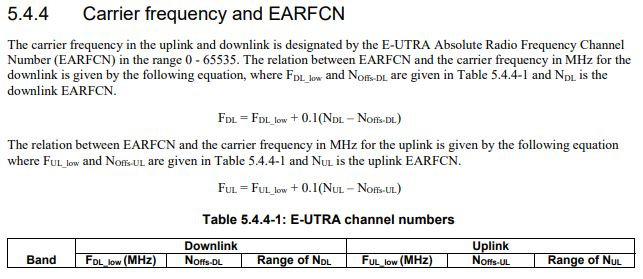
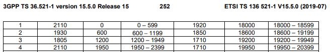
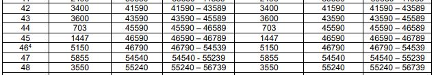

2020.03.29

# Operators, Spectrum

* [Mobile_operators_of_the_Americas](https://en.wikipedia.org/wiki/List_of_mobile_network_operators_of_the_Americas#United_States) 
* [QCOM slides on spectrum-for-4g-and-5g](https://www.qualcomm.com/media/documents/files/spectrum-for-4g-and-5g.pdf) 
* [wiki: 5G_NR_frequency_bands](https://en.wikipedia.org/wiki/5G_NR_frequency_bands) 

moz a loc service. [MAP](https://location.services.mozilla.com/map#2/35.0/9.0).  ----- [STATS](https://location.services.mozilla.com/stats)
------  [REGIONS](https://location.services.mozilla.com/stats/regions) 

# [PLMN =  Public Land Mobile Network](https://ltehacks.com/viewtopic.php?t=447)
* The PLMN consists of a series of numbers that identifies the **MCC (Mobile Country Code)** and  
* the **MNC (Mobile Network Code)** which is tied to a specific network carrier 
* In the USA (311), **Verizon PLMN** numbers include 311-480,..., 311-489 and [more](https://ltehacks.com/viewtopic.php?t=447). Hence Verizon MNC numbers are 480,481,... 

# Network Planning Related

### LTE EARFCN (E-UTRA Absolute Radio Frequency Channel Number)
* [ETSI TS136 521-1 V15.5.0 (2019-07), p.253 + ](https://www.etsi.org/deliver/etsi_ts/136500_136599/13652101/15.05.00_60/ts_13652101v150500p.pdf) 

* [LTE Carrier Frequency and EARFCN](https://www.cablefree.net/wirelesstechnology/4glte/lte-carrier-frequency-earfcn/) 
  - In LTE, the carrier frequency in the uplink and downlink is designated by EARFCN, which ranges between 0-65535.
  - EARFCN uniquely identify the LTE band and carrier frequency.
  - For example Band-1 and Band-4 can have same Rx frequency 2110-2170 MHz,  but their EARFCN are different.
  - EARFCN is independent of channel bandwidth.
  - The relation between EARFCN and its uplink/downlink carrier frequency is given by the equation below
  -      -- Fdownlink=FDLLow+0.1(NDL−NDLOffset)Fdownlink=FDLLow+0.1(NDL-NDLOffset)
  -      -- Fuplink=FULLow+0.1(NUL−NULOffset)
  -      -- NDL = downlink EARFCN = dl_earfcn
  -      -- NUL = uplink EARFCN   = ul_earfcn
  -      -- NDLoffset = offset used to calculate downlink EARFCN
  -      -- NULoffset = offset used to calculate uplink EARFCN

* [LTE EARFCN Radio Channel Numbers](https://www.electronics-notes.com/articles/connectivity/4g-lte-long-term-evolution/lte-earfcn-radio-channel-numbers.php) 
    - EARFCN number is within range 0 to 65535 .

### PCI = Physical Cell ID
* NR has 1008 PCIwhich are organised into 336 groups of 3
* LTE has 504 PCIwhich are organised into 168 groups of 3
* Requirements for PCI planning: Collision Free (UE centric - no cell) and Confusion Free (Cell centric - No neighbor confusion)
* [Physical Cell ID (PCI)](https://www.5gworldpro.com/blog/2020/11/11/what-is-difference-between-pci-in-4g-lte-and-pci-in-5g-nr/) 
    - one of the most important cell’s identifier in the wireless network of 4G and 5G system.
    - It is PHY cell id which is required for DL synchronization.
    - In LTE:  PCI = (3 × SSS) + PSS
      -- PSS has 3 values 0,1 and 2 and is created using Zad-off Chu sequence
      -- PSS helps to accomplish slot and symbol synchronization in the time domain.
      -- SSS has 168 values 0 to 167 and is produced using concatenation of 2 m-sequences (max length sequence)
      -- SSS aids to achieve radio frame synchronization
      -- E.g., PCI = (3 * 167) + 2 = 503, so PCI values will vary from 0 to 503 LTE supports 504 unique PCIs
    - UE should not be able to simulteneously receive multiple PCI with equal 'PCI mode 3' values (PSS constraint)
    - UE should not be able to simulteneously receive multiple PCI with equal 'PCI mode 4' values (DMRS constraint)
    - UE should not be able to simulteneously receive multiple PCI with equal 'PCI mode 30' values (PUSCH DMRS constraint when Transform Precoding is enabled).
    - Satisfying 'PCI mode 3' rule is sufficient condition for satisfying 'PCI mode 30' rule.

*  
*  
* 

# Carrier Aggregarion Related
* [5.4.2A.1	Channel bandwidths per operating band for CA (see TS 36.521-1-V15.5.0 p 161](https://www.etsi.org/deliver/etsi_ts/136500_136599/13652101/15.05.00_60/ts_13652101v150500p.pdf) 
    - See Tables starting from    Table 5.4.2A.1-1: E-UTRA CA configurations and bandwidth combination sets defined for intra-band
contiguous CA 

* 
* 

# Subscriber Identification

* [IMSI: International mobile subscriber identity](https://en.wikipedia.org/wiki/International_mobile_subscriber_identity) 

     A unique identifier of every user of a cellular network. It is stored as a 64-bit field and is sent by the mobile device 
     to the network. It is also used for acquiring other details of the mobile in the home location register (HLR) or as locally 
     copied in the visitor LR. To prevent eavesdroppers from identifying and tracking the subscriber on the radio interface, 
     the IMSI is sent as rarely as possible and a randomly-generated TMSI is sent instead.

* [E.212 : The international identification plan for public networks and subscriptions](https://www.itu.int/rec/T-REC-E.212-201609-I/en) 

     IMSI Format: Maximium 15 digits divided by: MCC (3 digist) + MNC (2-3 digits) + MSIN (<=10 digits), eg 
     
          * MCC :  Mobile Country Code
          * MNC :  Mpbile Network Code
          * MSIN : Mobile Subsciption Identification Number
          
* [Mobile Country Codes (MCC) and Mobile Network Codes (MNC)](https://www.mcc-mnc.com/)

          MCC	MNC	ISO	Country	Country Code	Network
          311	275	us	United States	1	Verizon Wireless
          311	480	us	United States	1	Verizon Wireless
          310	012	us	United States	1	Verizon Wireless
          310	270	us	United States	1	T-Mobile
          310	210	us	United States	1	T-Mobile

# Equipment Identification

* [IMEI: International Mobile Equipment Identity](https://en.wikipedia.org/wiki/International_Mobile_Equipment_Identity) 

    A number, usually unique, to identify 3GPP and iDEN mobile phones, as well as some satellite phones. It is usually found printed 
    inside the battery compartment of the phone, but can also be displayed on-screen on most phones by entering * #06# MMI Supplementary 
    Service code on the dialpad, or alongside other system information in the settings menu on smartphone operating systems.

* [SIM Card, ICCID](https://en.wikipedia.org/wiki/SIM_card#ICCID) 

    [ICCID](https://www.emnify.com/resources/iccid-number) stands for Integrated Circuit Card Identification Number. 
    It’s a unique 18-22 digit code that includes a SIM card’s country, home network, and identification number. 
    You’ll usually find an ICCID printed on the back of a SIM card, but sometimes it’s included in the packaging materials instead.
    
* [SEID and NFC](https://en.wikipedia.org/wiki/Near-field_communication) 

     * Near-Field-Communication (NFC) is a set of communication protocols for communication between two electronic devices over a 
     distance of 4 cm or less. NFC offers a low-speed connection with simple setup that can be used to bootstrap more-capable wireless connections.
     * The Secure Element chip, an NFC chip that contains data such as the Secure Element Identifier (SEID) for secure transactions. 
     This chip is commonly found in smartphones and other NFC devices.
     
# Other

* [www.techplayon.com/5g-nr-interfaces-x2-xn-s1-ng-f1-and-e1-functions/](http://www.techplayon.com/5g-nr-interfaces-x2-xn-s1-ng-f1-and-e1-functions/) 
*  
*  
*  
*  
*  
