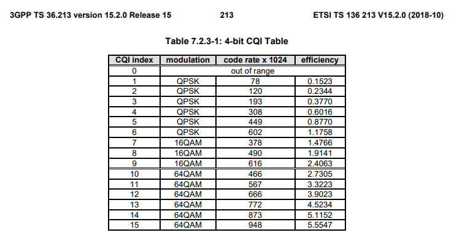
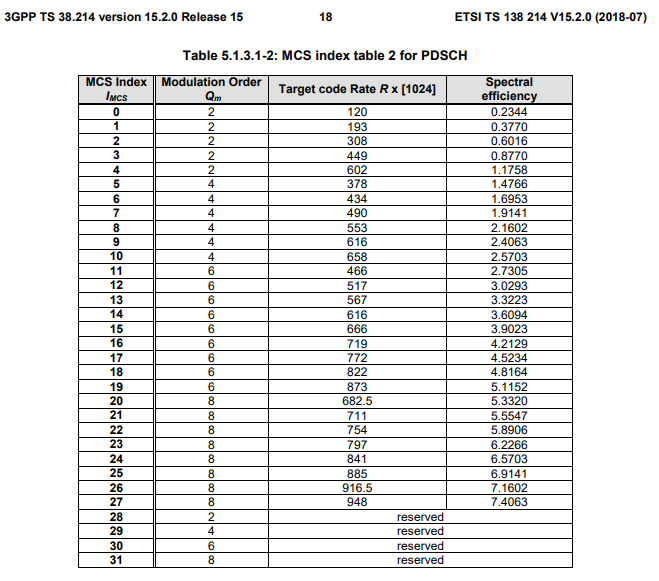
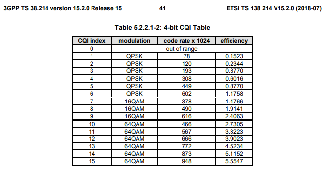

2020.03.29

## OFDMA/OFDMA/SC-FDMA

[2020: Iain: OFDM Waveforms](https://www.youtube.com/watch?v=F6B4Kyj2rLw) 

[2016: 2.3 - OFDM/ OFDMA IN 4G LTE - PART 1](https://www.youtube.com/watch?v=rKy5dOl3Et4) 

[2017: Irfan Ali: LTE Radio Primer Part 8: DL Summary & References  -  OFDM in Multicolor](https://youtu.be/AdwWBls_VW0?t=50) 

 
 
 

## Path Loss, Propagation Formula

* [3GPP TR 25.996. Universal Mobile Telecommunications System (UMTS); Spacial channel model for - See p. 17 for modified COST 231 Hata Urban Propagation model.](https://www.etsi.org/deliver/etsi_tr/125900_125999/125996/06.01.00_60/tr_125996v060100p.pdf) 
* [2017: Report ITU-R SM.2028-2: Monte Carlo simulation methodology for the use in sharing and compatibility studies between different radio services or systems](https://www.itu.int/dms_pub/itu-r/opb/rep/R-REP-SM.2028-2-2017-PDF-E.pdf) 
* [MATLAB propagation-channel-models](https://www.mathworks.com/help/lte/ug/propagation-channel-models.html) 
* [2019: IMPROVED PROPAGATION MODELS FOR LTE PATH LOSS PREDICTION IN URBAN & SUBURBAN GHANA](https://arxiv.org/ftp/arxiv/papers/2001/2001.05227.pdf) 
 
 
 
 
 

## Phy Abstraction

[2018: PHY Abstraction Techniques for IEEE 802.11p and LTE-V2V: Applications and Analysis, DOI: 10.1109/GLOCOMW.2018.8644470](https://www.researchgate.net/publication/330222535_PHY_Abstraction_Techniques_for_IEEE_80211p_and_LTE-V2V_Applications_and_Analysis) 
 
 
 
 
 

## LTE

    RB = (12 subcarriers=180 KHz) x (7 symbols = 1 Slot = 0.5 msec)   =   180 kHz x 0.5 msec
    RE = 1 subcarrier x 1 symbol = 15 kHz x (0.5/7=0.0714) ms = log2(M) bits/SubCarrier/Symbol
    RB = 84 REs = 84*log2(M) bits/RB 
        If M=64 QAM, then 1 RB can transmit at most 84*log2(64) = 84*6 = 504 bits/(0.5 sec)/180 KHz = 1008 bps/180KHz
          If Channel BW=10 MHz, then 50 RBs can transmit at most 50*1008 = 50400 = 50.4 Mbps/10 MHz

| ch BW    | usable BW (UBW)| UBW in SubCarriers | UBW in RBs   | Msmt Window Sz     | Wnd sz in raster Freqs  |
|:---:     |:---:           |:---:               |:---:         |:---:               | :---:                   |
|  1.4 MHz |1.08  MHz|   72       |   6   |  1.1 MHz|   11       |
|  3  MHz  | 2.7  MHz|   180      |  15   |  2.7 MHz|   27       |
|  5  MHz  | 4.5  MHz|   300      |  25   |  4.5 MHz|   45       |
|  10  MHz | 9  MHz  |   600      |  50   |  9.1 MHz|   91       |
|  15  MHz |13.5  MHz|   900      |  75   | 13.5 MHz|  135       |
|  20  MHz | 18   MHz|  1200      | 100   | 18.1 MHz|  181       |

## RSRP, RSSI, SRRQ, CQI

[2012: dave mcnally: RSRQ Calculator.avi](https://youtu.be/FVgLUBVjKu4) 
See section [5.5.4 of 36.331](https://www.etsi.org/deliver/etsi_ts/136300_136399/136331/15.03.00_60/ts_136331v150300p.pdf) for LTE or 
[38.331](https://www.etsi.org/deliver/etsi_ts/138300_138399/138331/15.07.00_60/ts_138331v150700p.pdf) for NR to see all events that can be configured to the UE to trigger a measurement report  
[2017: Irfan Ali: LTE Radio Primer Part 7: DL Cell Reference Signals, RSRP & RSRQ](https://www.youtube.com/watch?v=XAtQq7zHvQ0) 

    4/84 REs are used for Reference Signal (==> RSRP)
        Cell Reference Singals (CRS) are carried in two symbols: 0 and 4 (or 1st and 5th) and
        CRS subcarriers are determined by Physycal Layer Cell Idenitty (PCI) of the cell (UE figures PCI from PSS and SSS)
        
    UE measures RSRP = avg power in watts received by a single Reference Signal (RS) RE
        RSRP measures only RS power and excludes all noise and interference: RSRP = {1/K}\Sum_{k=1}^K P_{rs,k}
        P_{rs,k} is the estimated RX power (in W) by the k-th RS RE
        
    Typically CRS (REs with RS) are TXed at much higher power than other REs
        max RSRP ~ max input to UE = -25 dBm = 0.0032 mW
            in 1.4 MHz BW w/ 6 RBs (72 REs) max RSRP = -44 dBm
        min RSRP  = -140 dBm (has 6 dBm margin over the min RX power @ UE)
        
    Knowledge of absolute RSRP allows the UE to calculate DL PL
    
    RRSI (Received Signal Strength Indicator) = measured only in OFDM symbols containing the RSs
        Example: in 1.4 MHz case (w/ 6 RBs), RSSI is measured and added over all 6 RBs for the 1st symbol (or the 5th symbol)
        
    RSRQ (Reference Signal Received Quality) = RSRP/(RSSI/N_{RB})
        RSRQ is important for scheduling for UE at cell edge and Hand-over decisions
        max RSRQ = -3 dB (one RS RE has 50% of the total power per symbol)
        min RSRQ = -19.5 dB (one RS RE has only 1% energy in RB)

# LTE CQI

* [LTE 4-bit CQI Table 5.2.2..1-2 in Physical layer procedures (3GPP TS 36.213 version 15.2.0 Release 15)](https://www.etsi.org/deliver/etsi_ts/136200_136299/136213/15.02.00_60/ts_136213v150200p.pdf) 

       7.2.3 Channel Quality Indicator (CQI) definition
       * The CQI indices and their interpretations are given in Table 7.2.3-1, Table 7.2.3-5, Table 7.2.3-6 
         for reporting CQI based on QPSK, 16QAM and 64QAM. 
       * The CQI indices and their interpretations are given in Table 7.2.3-2 for reporting CQI based on QPSK, 16QAM, 
         64QAM and 256QAM. 
       * The CQI indices and their interpretations are given in Table 7.2.3-3 for reporting CQI based on QPSK and 16QAM. 
       * The CQI indices and their interpretations are given in Table 7.2.3-4 for reporting CQI based on QPSK, 16QAM, 
         64QAM, 256QAM, and 1024QAM. 
       
       the UE shall derive for each CQI value reported in uplink subframe/slot/subslot n the highest CQI index between 1 and 15 
       in Table 7.2.3-1, Table 7.2.3-2 or Table 7.2.3-4     ( Table 7.2.3-3, Table 7.2.3-5 or Table 7.2.3-6 ) 
       if a single PDSCH transport block with a combination of modulation scheme 
       and transport block size corresponding to the CQI index, and occupying a group of downlink physical resource blocks termed 
       the CSI reference resource, could be received with a transport block error probability not exceeding 0.1.
       

       5 Power control
            Downlink power control determines the Energy Per Resource Element (EPRE). The term resource element energy
            denotes the energy prior to CP insertion. The term resource element energy also denotes the average energy taken over
            all constellation points for the modulation scheme applied. Uplink power control determines the average power over a
            SC-FDMA symbol in which the physical channel is transmitted.
          5.1 Uplink power control 
            5.1.4.1 Dual connectivity power control Mode 1 
            5.1.4.2 Dual connectivity power control Mode 2

# NR 5G CQI

* [5G;NR;Physical layer procedures for data (3GPP TS 38.214 version 15.2.0 Release 15) p.41 Table 5.2.2.1-2: 4-bit CQI Table](https://www.etsi.org/deliver/etsi_ts/138200_138299/138214/15.02.00_60/ts_138214v150200p.pdf) 

        5.1.3 Modulation order, target code rate, redundancy version and transport block size determination 
         To determine the modulation order, target code rate, and transport block size(s) in the physical downlink shared 
        channel, the UE shall first
           - read the 5-bit modulation and coding scheme field (IMCS) in the DCI to determine the modulation order (Qm) and
             target code rate (R) based on the procedure defined in Subclause 5.1.3.1, and
           - read redundancy version field (rv) in the DCI to determine the redundancy version..
        and second
           - the UE shall use the number of layers (ʋ), the total number of allocated PRBs before rate matching (nPRB) to
             determine to the transport block size based on the procedure defined in Subclause 5.1.3.2.

             

        The CQI indices and their interpretations are given in Table 5.2.2.1-2 or Table 5.2.2.1-4 for reporting CQI based on
        QPSK, 16QAM and 64QAM. The CQI indices and their interpretations are given in Table 5.2.2.1-3 for reporting CQI
        based on QPSK, 16QAM, 64QAM and 256QAM.
        
             

 

## DL Power Control

[2018:  Hassan Atique: LTE DL Power Allocation](https://www.youtube.com/watch?v=gwJU5TvMivk) 

    
## UL Power Control

[sharetechnote: LTE Power Control](https://www.sharetechnote.com/html/PowerControl_LTE.html) 
[Blog: http://www.techtrained.com/lte-power-control/](http://www.techtrained.com/lte-power-control/) 

    Downlink Power Control
        In case of 4G DL, rather than varying power in the Downlink, full power is distributed uniformly over the whole bandwidth. 
        The same Power Spectral Density (PSD) is used on all DL channels. 
        For example, PDSCH, PHICH, PDCCH etc. PSD is the power of a signal divided by Bandwidth (PSD = Power / Bandwidth). 
        In case of PSD, it is normalized to one RB. Note: There are certain channels in DL, where power is varied accordingly. 
    UL PC - In contrast to DL, in Uplink in LTE, Power control is used mainly for the following two reasons.
        limit intracell and intercell interference
        reduce UE power consumption
    Usually in UL PC is done in two ways: Conventional Power Control, and Fractional Power control.        
    
[Bilal Muhammad: Closed loop power control for LTE uplink (see p 13 for LTE PUSCH power control) ](https://www.diva-portal.org/smash/get/diva2:831452/FULLTEXT01.pdf) 
[3GPP TS 36.213 Rel 14 - see pp 14-15 for detailed formula on LTE UL PC](https://www.etsi.org/deliver/etsi_ts/136200_136299/136213/14.06.00_60/ts_136213v140600p.pdf) 
 
 

## 5G  

[5G NR frequency bands](https://en.wikipedia.org/wiki/5G_NR_frequency_bands) 

[5G Network Architecture White Paper v1.0 12-08-2018](http://www.gtigroup.org/d/file/Resources/rep/2018-02-22/06608ce6dbe32673ac1611359e11f794.pdf)

[5G K-Sim](http://5gopenplatform.org)

[5G K-SimLink](http://5gopenplatform.org/main/main.php?categoryid=06&menuid=01&groupid=00)

[5G tutorial from MathWorks](http://5gopenplatform.org/main/main.php?categoryid=06&menuid=01&groupid=00)

moz a loc service. [MAP](https://location.services.mozilla.com/map#2/35.0/9.0).  ----- [STATS](https://location.services.mozilla.com/stats)
------  [REGIONS](https://location.services.mozilla.com/stats/regions) 
 
 

